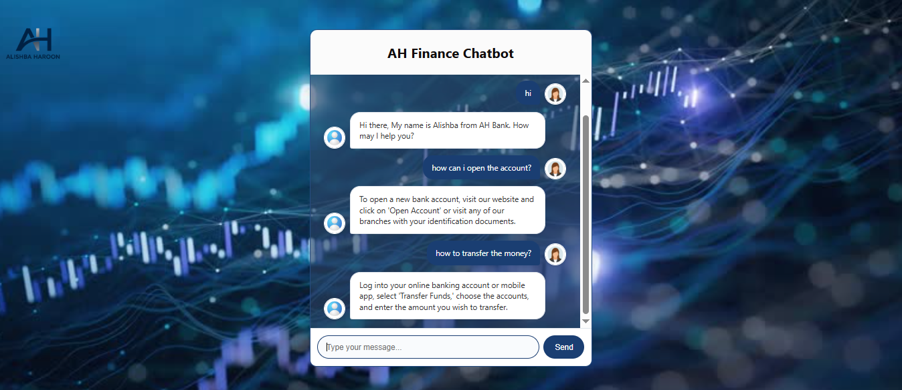
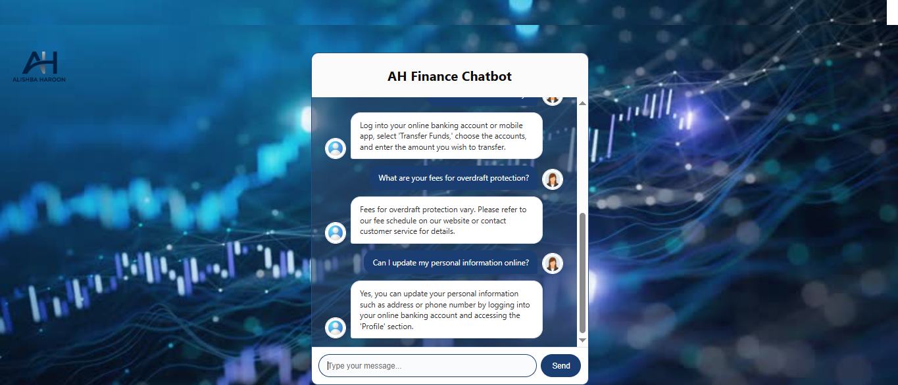

# 💬 Finance Chatbot

An AI-powered chatbot that answers common banking and finance-related questions using a predefined dataset. Built with Flask, HTML/CSS, and Python, it mimics real customer support interactions in the finance domain.

---

## 📌 Features
- Responds to finance-related queries (e.g., loans, payments, account issues)
- Trained on a custom banking Q&A dataset
- User-friendly web interface using HTML templates
- Powered by simple rule-based or NLP techniques

---

## 🧠 Tech Stack
- **Backend**: Python, Flask
- **Frontend**: HTML, CSS (via templates and static folders)
- **Data**: `Dataset_Banking_chatbot.csv` (CSV-based response engine)

---

## 📁 Project Structure

Finance Chatbot/
├── app.py # Main Flask app
├── Dataset_Banking_chatbot.csv # Chatbot training data
├── templates/ # HTML templates (frontend UI)
├── static/ # Static files (images, CSS)

---

## 🚀 How to Run

### 📦 1. Install Requirements
Make sure Flask is installed:

pip install flask
python app.py

## 🖼️ Screenshots

🔹 Homepage

🔹 Chat Interface

🔹 Example Reply

📄 License
MIT – Free to use, modify, and distribute.
